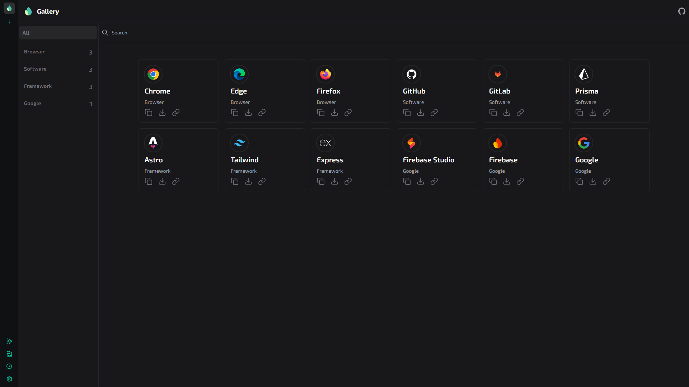

# SVG Gallery

A web-based SVG image gallery built with React, Vite, and Tailwind CSS. This project allows you to view and explore SVG files quickly and efficiently.



## 🚀 Features

- Display SVG files in a user-friendly interface.
- Responsive design for all screen sizes.
- Modular structure using React and Vite.
- Modern styling with Tailwind CSS.

## 📦 Tech Stack

- [React](https://reactjs.org/)
- [Vite](https://vitejs.dev/)
- [Tailwind CSS](https://tailwindcss.com/)
- [PostCSS](https://postcss.org/)

## 📂 Project Structure

SVG-Gallery/
├── public/
│ └── preview.png
├── src/
│ ├── components/
│ ├── assets/
│ └── App.jsx
├── index.html
├── package.json
├── tailwind.config.js
└── vite.config.js


## 🛠️ Installation & Usage

1. **Clone the repository:**

   ```bash
   git clone https://github.com/Keiver-Dev/SVG-Gallery.git
   cd SVG-Gallery

    Install dependencies:

npm install

Start the development server:

    npm run dev

    Then open your browser at http://localhost:5173.

📄 License

This project is licensed under the MIT License. See the LICENSE file for more details.
🤝 Contributing

Contributions are welcome! If you'd like to improve the gallery or add new features, feel free to open a pull request.